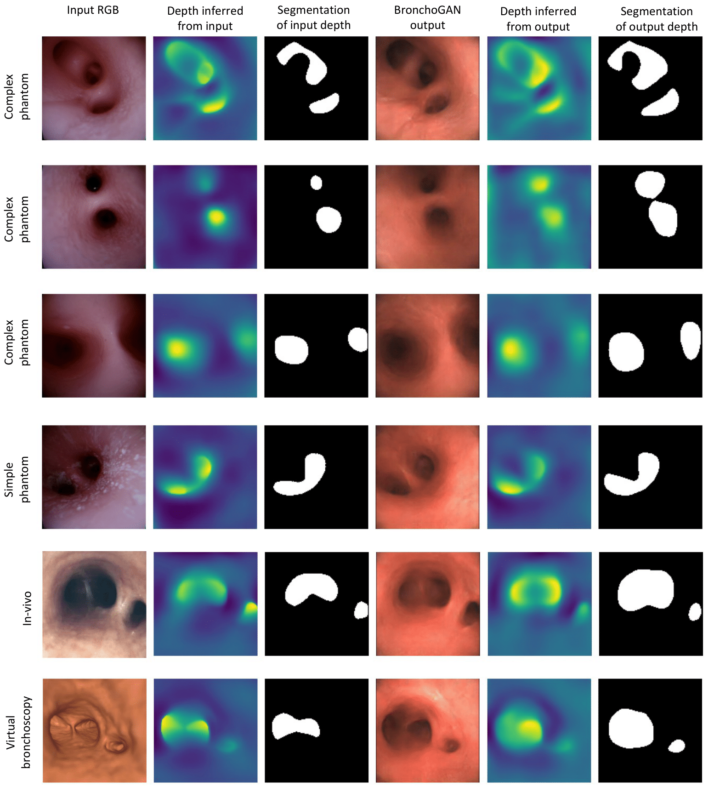

# BronchoGAN: Anatomically Consistent and Domain-Agnostic Image-to-Image Translation for Video Bronchoscopy

## Overview

BronchoGAN is a novel approach for generating realistic bronchoscopy (RB) images from depth maps. The pipeline works as follows:

1. **Depth Extraction**: Uses DepthAnything V2 to extract depth maps from input images as domain-agnostic intermediate representation
2. **Depth-to-RB Translation**: Trains a conditional GAN (pix2pixHD) to translate depth images to realistic bronchoscopy (RB) images
3. **Anatomical Constraints**: During training, bronchial orifices are segmented from both input depth maps and generated RB images to enforce anatomical consistency through DICE loss
4. **Dual Segmentation Pipeline**: Uses both LiteRASPP (for RGB images) and ZSegmentationExtractor with DepthAnything (for depth-based segmentation) during training

The key innovation is using depth images as an intermediate representation that enables robust domain-agnostic translation while preserving critical anatomical structures like bronchial orifices through dual segmentation constraints.


## Architecture Overview

The BronchoGAN model integrates multiple components:

```
                    ┌─────────────────┐
                    │   Input Depth   │
                    │    (Domain      │
                    │   Agnostic)     │
                    └─────────┬───────┘
                              │
                              ▼
                    ┌─────────────────┐
                    │  Generator (G)  │
                    │   pix2pixHD     │
                    └─────────┬───────┘
                              │
                              ▼
                    ┌─────────────────┐
                    │ Synthetic RB    │
                    │    Image        │
                    └─────┬───────────┘
                          │
           ┌──────────────┼──────────────┐
           │              │              │
           ▼              ▼              ▼
    ┌─────────────┐ ┌────────────┐ ┌─────────────┐
    │Discriminator│ │    RGB     │ │   Depth     │
    │  D1,D2,D3   │ │Segmentation│ │Segmentation │
    │ Multi-Scale │ │ LiteRASPP  │ │ZSegExtractor│
    └─────┬───────┘ └─────┬──────┘ └─────┬───────┘
          │               │              │
          ▼               ▼              ▼
    ┌─────────────┐ ┌────────────┐ ┌─────────────┐
    │Adversarial  │ │   Input    │ │DepthAnything│
    │    Loss     │ │   Depth    │ │+ Filtering  │
    │   L_GAN     │ │Segmentation│ │             │
    └─────┬───────┘ └─────┬──────┘ └─────┬───────┘
          │               │              │
          ▼               └──────┬───────┘
    ┌─────────────┐              │
    │  Feature    │              ▼
    │ Matching    │        ┌─────────────┐
    │   L_FM      │        │    DICE     │
    └─────┬───────┘        │    Loss     │
          │                │ Anatomical  │
          ▼                │ Consistency │
    ┌─────────────┐        └─────┬───────┘
    │     VGG     │              │
    │ Perceptual  │              │
    │   L_VGG     │              │
    └─────┬───────┘              │
          │                      │
          └──────┬─────────────────┘
                 │
                 ▼
         ┌───────────────┐
         │   Total Loss  │
         │ L_G = L_GAN + │
         │ λ_FM·L_FM +   │
         │ λ_VGG·L_VGG + │
         │ λ_DICE·L_DICE │
         └───────────────┘
```

## Dataset Preparation

### Step 1: Extract Depth Maps from Input Images using Depth Anything V2

#### Prerequisites

1. **Install Dependencies**
```bash
git clone https://github.com/DepthAnything/Depth-Anything-V2
cd Depth-Anything-V2
pip install -r requirements.txt
```

2. **Download Pre-trained Models**

Download the DepthAnything V2 Large model and place it in your model directory:

| Model | Parameters | Download Link | Use Case |
|-------|------------|---------------|----------|
| Depth-Anything-V2-Large | 335.3M | [Download](https://huggingface.co/depth-anything/Depth-Anything-V2-Large-hf) | Best quality (recommended) |

#### Depth Extraction Implementation

**Single Image Inference:**
```python
import cv2
import torch
import numpy as np
from depth_anything_v2.dpt import DepthAnythingV2

# Setup device
DEVICE = 'cuda' if torch.cuda.is_available() else 'cpu'

# Model configuration for DepthAnything V2 Large
model_configs = {
    'vitl': {'encoder': 'vitl', 'features': 256, 'out_channels': [256, 512, 1024, 1024]},
}

# Initialize model (BronchoGAN uses 'vitl' for best results)
encoder = 'vitl'
model = DepthAnythingV2(**model_configs[encoder])
model.load_state_dict(torch.load('depth_anything_v2_vitl.pth', map_location='cpu'))
model = model.to(DEVICE).eval()

# Process single image
def extract_depth_single(image_path, output_path):
    raw_img = cv2.imread(image_path)
    
    # Infer depth
    depth = model.infer_image(raw_img)  # HxW raw depth map in numpy
    
    # Inversion for bronchoscopy analysis (higher values for closer structures)
    max_depth = depth.max()
    inverted_depth = max_depth - depth
    
    # Save depth maps
    np.save(output_path.replace('.png', '_depth.npy'), depth)
    np.save(output_path.replace('.png', '_inverted_depth.npy'), inverted_depth)
    
    # Save visualizations
    depth_vis = (depth - depth.min()) / (depth.max() - depth.min()) * 255
    cv2.imwrite(output_path.replace('.png', '_depth.png'), depth_vis.astype(np.uint8))
    
    return depth, inverted_depth

# Example usage
depth_map, inverted_depth_map = extract_depth_single('path/to/input_image.jpg', 'path/to/depth_output.png')
```

**Batch Processing for Dataset:**
```python
import os
from tqdm import tqdm

def process_dataset(input_images_dir, depth_output_dir, model):
    os.makedirs(depth_output_dir, exist_ok=True)
    
    image_extensions = ['.jpg', '.jpeg', '.png', '.bmp']
    image_files = []
    
    for ext in image_extensions:
        image_files.extend([f for f in os.listdir(input_images_dir) if f.lower().endswith(ext)])
    
    print(f"Found {len(image_files)} images to process")
    
    for image_file in tqdm(image_files, desc="Extracting depth maps"):
        image_path = os.path.join(input_images_dir, image_file)
        base_name = os.path.splitext(image_file)[0]
        depth_npy_path = os.path.join(depth_output_dir, f"{base_name}_depth.npy")
        
        try:
            raw_img = cv2.imread(image_path)
            if raw_img is None:
                continue
                
            depth = model.infer_image(raw_img)
            np.save(depth_npy_path, depth)
            
        except Exception as e:
            print(f"Error processing {image_path}: {str(e)}")

# Usage
process_dataset("path/to/input_images", "path/to/depth_outputs", model)
```

---

## Step 2: Prepare Training Dataset Structure

Organize your data for training the Depth-to-RB translation model:

```
dataset/
├── train/
│   ├── A/              # Input depth images (.png format)
│   └── B/              # Target RB images (.jpg, .png)
├── test/
│   ├── A/              # Test depth images
│   └── B/              # Test RB images (optional)
└── val/
    ├── A/              # Validation depth images  
    └── B/              # Validation RB images (optional)
```

**Data Pairing Requirements:**
- Depth images in `A/` and RB images in `B/` should have corresponding filenames
- Example: `depth_001.png` in `A/` corresponds to `rb_001.jpg` in `B/`

---

## Step 3: Install Dependencies and Setup

### Install Training Dependencies

```bash
pip install torch torchvision
pip install opencv-python numpy tqdm
pip install tensorboard dominate
pip install scikit-image  # For segmentation processing
pip install scipy  # For filtering operations
```

### Directory Structure

Based on your project structure, ensure you have the following organization:

```
BronchoGAN/
├── data/                           # Dataset folder
├── models/                         # Model definitions
│   ├── __init__.py
│   ├── pix2pixHD_model.py         # Main BronchoGAN model (your code)
│   ├── base_model.py
│   ├── networks.py
│   └── depth_anything_v2/
│       └── dpt.py                  # DepthAnything V2 implementation
├── options/                        # Training and testing configurations
│   ├── train_options.py
│   └── test_options.py
├── segment_model/                  # Pre-trained segmentation weights
│   └── fine_tuning.pt             # Pre-trained LiteRASPP weights
├── segment_script/                 # Segmentation pipeline components
│   ├── lr_aspp.py                 # LiteRASPP segmentation model
│   ├── modelio.py                 # Model I/O utilities
│   └── util.py                    # ZSegmentationExtractor
├── util/                          # Utility functions
│   ├── image_pool.py
│   └── visualizer.py
├── .gitignore                     # Git ignore file
├── .config.yml                    # Configuration file
├── encode_features.py             # Feature encoding utilities
├── eval_test                      # Evaluation notebook
├── LICENSE                        # License file
├── precompute_feature_maps.py     # Feature map preprocessing
├── README.md                      # Project documentation
├── run_engine.py                  # Engine runner
├── test.py                        # Testing script
├── train.py                       # Training script
├── train_model                    # Training notebook
└── depth_anything_v2_vitl.pth     # DepthAnything weights (download separately)
```

---

## Step 4: Segmentation Pipeline Components

### LiteRASPP Segmentation (segment_script/lr_aspp.py)

The RGB image segmentation component:

```python
class LiteRASPP(LoadableModel):
    def __init__(self, backbone='resnet18', n_class=1, spatial_dim=128):
        # ResNet18 backbone for feature extraction
        self.encoder = IntermediateLayerGetter(resnet18(pretrained=True))
        
        # Squeeze-and-excitation attention
        self.squeeze_and_excitation = nn.Sequential(
            nn.AdaptiveAvgPool2d(1),
            nn.Conv2d(self.high_channel, self.inter_channel, kernel_size=1),
            nn.Sigmoid()
        )
        
        # Dual-branch classification
        self.classifier_high = nn.Conv2d(self.inter_channel, n_class, kernel_size=1)
        self.classifier_low = nn.Conv2d(self.low_channel, n_class, kernel_size=1)
```

### ZSegmentationExtractor (segment_script/util.py)

The depth-based segmentation component:

```python
class ZSegmentationExtractor:
    def __init__(self, spatial_dim=128, watershed_compactness=3, 
                 avg_pool_kernel_size=1, corner_margin=25, edge_margin=7, 
                 intensity_threshold=0.5):
        # Segmentation parameters for depth-based orifice detection
        
    def extract_segmentation(self, depth_tensor, rgb_img=None, return_plot_data=True):
        # Extracts bronchial orifices from depth maps using watershed and filtering
```

---

## Step 5: Training BronchoGAN with Dual Segmentation Constraints

### Model Architecture Integration

The `Pix2PixHDModel` class integrates all components:

```python
class Pix2PixHDModel(BaseModel):
    def initialize(self, opt):
        # Initialize generator and discriminators
        self.netG = networks.define_G(...)  # pix2pixHD generator
        self.netD = networks.define_D(...)  # Multi-scale discriminators
        
        # Initialize segmentation models
        self.segmentation_model = LiteRASPP.load('./segment_model/fine_tuning.pt', device).eval()
        self.depth_model = self._setup_depth_model()  # DepthAnything V2
        self.segmentation_extractor = ZSegmentationExtractor(...)
        
    def forward(self, label, inst, image, feat, infer=False):
        # Generate fake RB image
        fake_image = self.netG.forward(input_concat)
        
        # Dual segmentation for anatomical constraints
        # 1. RGB-based segmentation
        real_binary_mask = self.segment_image(real_image)  # LiteRASPP
        fake_binary_mask = self.segment_image(fake_image)  # LiteRASPP
        
        # 2. Depth-based segmentation  
        input_depth_mask = self.process_depth_and_segment(input_label, is_input_label=True)
        fake_depth_mask = self.process_depth_and_segment(fake_image, is_input_label=False)
        
        # Calculate DICE losses
        dice_loss_rgb = self.dice_loss(real_binary_mask, fake_binary_mask)
        dice_loss_depth = self.dice_loss(input_depth_mask, fake_depth_mask)
        
        # Combine losses
        total_loss = loss_G_GAN + λFM * loss_G_GAN_Feat + λVGG * loss_G_VGG + λDICE * dice_loss_depth
```

### Training Configuration

```bash
python train.py \
  --dataroot ./dataset \
  --name bronchogan_depth2rb \
  --model pix2pixHD \
  --netG global \
  --ngf 64 \
  --num_D 3 \
  --n_layers_D 3 \
  --lambda_feat 10.0 \
  --lambda_vgg 10.0 \
  --lambda_dice 5.0 \
  --no_instance \
  --label_nc 0 \
  --batchSize 4 \
  --niter 100 \
  --niter_decay 100 \
  --lr 0.0002 \
  --beta1 0.5 \
  --gpu_ids 0
```

### Key Training Parameters

| Parameter | Description | Recommended Value |
|-----------|-------------|-------------------|
| `--lambda_dice` | Weight for anatomical DICE loss | 5.0 |
| `--lambda_feat` | Weight for feature matching loss | 10.0 |
| `--lambda_vgg` | Weight for perceptual VGG loss | 10.0 |
| `--netG global` | Use global generator architecture | Required |
| `--no_instance` | Disable instance maps (for depth input) | Required |
| `--label_nc 0` | Use continuous input (depth maps) | Required |

---

## Step 6: Loss Function Components

### Anatomical Consistency through Dual Segmentation

The model enforces anatomical consistency through two segmentation pathways:

#### 1. RGB-based Segmentation Loss
```python
def segment_image(self, image):
    # Normalize RGB image
    mu, sigma = self.calculate_mean_std(image)
    normalized_image = (image - mu.view(1, 3, 1, 1)) / sigma.view(1, 3, 1, 1)
    
    # LiteRASPP segmentation
    with torch.no_grad():
        logits = self.segmentation_model(normalized_image)
        softmax_scores = F.interpolate(logits, size=image.size()[2:], mode='bilinear')
        mask = (softmax_scores.squeeze().softmax(0)[1] >= 0.55).float()
    return mask.repeat(1, 3, 1, 1)  # Match RGB channels
```

#### 2. Depth-based Segmentation Loss
```python
def process_depth_and_segment(self, image, is_input_label=False):
    if is_input_label:
        # Use input depth directly
        depth_tensor = image[0][0].to(self.device)
    else:
        # Generate depth from RGB using DepthAnything
        depth = self.depth_model.infer_image(image_np)
        max_depth = depth.max()
        inverted_depth = max_depth - depth
        
        # Apply high-pass filtering
        cutoffs = [0.0126, 0.05, 0.32]
        highpass_depths = self.get_filtered(inverted_depth, cutoffs)
        depth_tensor = torch.from_numpy(highpass_depths[0])
    
    # Extract segmentation using ZSegmentationExtractor
    segmentation_data = self.segmentation_extractor.extract_segmentation(depth_tensor)
    binary_mask = (segmentation_data['seg_mask'] > 0).float()
    return binary_mask
```

#### 3. DICE Loss Calculation
```python
def dice_loss(self, true_mask, pred_mask, smooth=1.0):
    true_mask = true_mask.view(true_mask.size(0), -1)
    pred_mask = pred_mask.view(pred_mask.size(0), -1)
    
    intersection = (true_mask * pred_mask).sum(dim=1)
    union = true_mask.sum(dim=1) + pred_mask.sum(dim=1)
    
    dice = (2. * intersection + smooth) / (union + smooth)
    return 1 - dice.mean()
```

### Complete Loss Function

```python
# Total Generator Loss
loss_G = loss_G_GAN +                    # Adversarial loss
          λFM * loss_G_GAN_Feat +        # Feature matching loss  
          λVGG * loss_G_VGG +            # Perceptual loss
          λDICE * dice_loss_depth        # Anatomical consistency loss

# Total Discriminator Loss
loss_D = 0.5 * (loss_D_fake + loss_D_real)
```

---

## Step 7: Training Monitoring and Output

### Monitor Training Progress

```bash
# View training logs
tensorboard --logdir ./checkpoints/bronchogan_depth2rb

# Check generated samples during training  
open ./checkpoints/bronchogan_depth2rb/web/index.html
```

### Key Metrics to Monitor

- **G_GAN**: Generator adversarial loss (should decrease)
- **D_real/D_fake**: Discriminator losses (should stay balanced ~0.5)
- **G_GAN_Feat**: Feature matching loss (improves structural consistency)
- **G_VGG**: Perceptual loss (improves visual realism)
- **G_DICE**: Anatomical consistency loss (preserves bronchial orifices)

### Training Output Structure

```
checkpoints/bronchogan_depth2rb/
├── iter.txt                    # Current epoch/iteration
├── latest_net_G.pth           # Latest generator weights
├── latest_net_D.pth           # Latest discriminator weights
├── [epoch]_net_G.pth          # Epoch-specific saves
├── web/                       # Training visualizations
│   ├── images/                # Generated samples
│   └── index.html            # Progress webpage
└── loss_log.txt              # Training losses
```


## Step 8: Testing and Inference

### Generate RB Images from Depth

```bash
python test.py \
  --dataroot ./dataset \
  --name bronchogan_depth2rb \
  --model pix2pixHD \
  --netG global \
  --which_epoch latest \
  --no_instance \
  --label_nc 0 \
  --results_dir ./results
```

### Inference with Segmentation Output

The model returns both generated images and segmentation masks:

```python
def inference(self, label, inst, image=None):
    # Generate RB image
    fake_image = self.netG.forward(input_concat)
    
    # Generate segmentation mask
    segmented_mask = self.segment_image(fake_image)
    
    return fake_image, segmented_mask
```




## Model Benefits

1. **Dual Segmentation Constraints**: Uses both RGB-based (LiteRASPP) and depth-based (ZSegmentationExtractor) segmentation for robust anatomical preservation
2. **Domain Agnostic**: Depth intermediate representation works across different input domains
3. **Anatomical Consistency**: DICE loss ensures bronchial orifices are preserved during translation
4. **High-Quality Generation**: Multi-scale discriminators and perceptual losses ensure realistic output
5. **Flexible Architecture**: Can handle various input types through the depth representation

---
